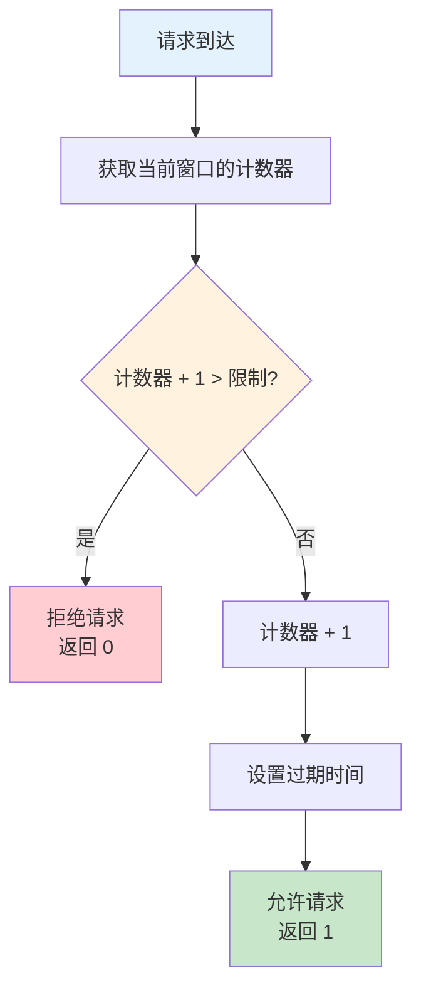
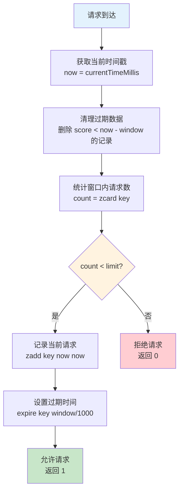
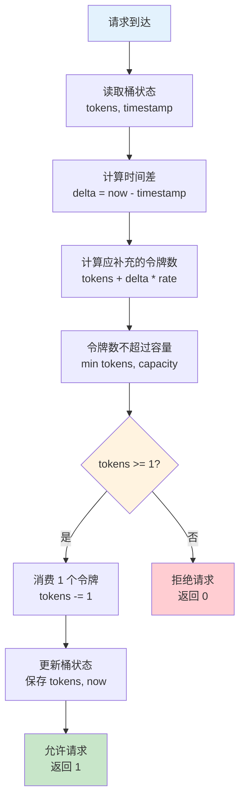
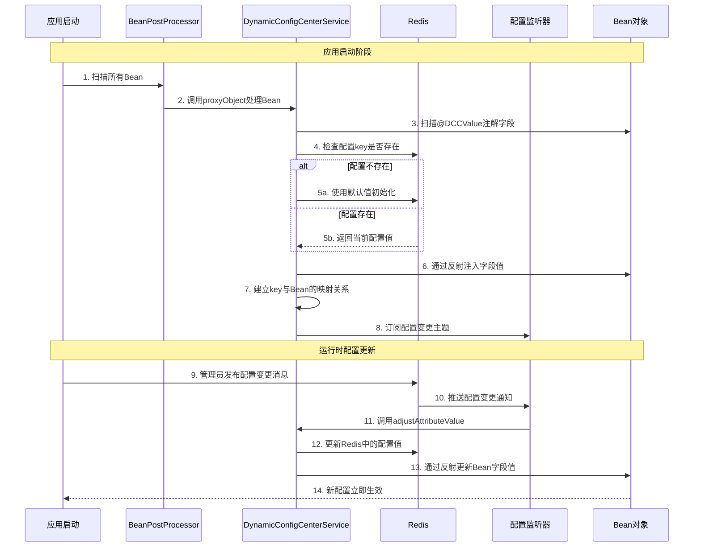

# Winter Redis DCC Spring Boot Starter

<div align="center">

[](https://search.maven.org/artifact/io.github.hahaha-zsq/winter-redis-ddc-spring-boot-starter)
[](https://www.apache.org/licenses/LICENSE-2.0)
[](https://spring.io/projects/spring-boot)
[](https://redisson.org/)

一个功能强大的 Redis 工具包，基于 Spring Boot 和 Redisson 构建，提供分布式锁、限流、布隆过滤器、动态配置中心等企业级功能。

[快速开始](#-快速开始) • [核心功能](#-核心功能) • [架构设计](#-架构设计) • [限流算法](#-限流算法详解)

</div>

---

## 📖 目录

- [项目简介](#-项目简介)
- [核心功能](#-核心功能)
- [快速开始](#-快速开始)
- [架构设计](#-架构设计)
- [限流算法详解](#-限流算法详解)
- [动态配置中心](#-动态配置中心)
- [配置说明](#-配置说明)

---

## 🎯 项目简介

Winter Redis DCC Spring Boot Starter 是一个企业级 Redis 工具包，它深度封装了 Spring Data Redis 和 Redisson，提供开箱即用的分布式解决方案。

### 为什么选择 Winter Redis DCC？

- **🚀 开箱即用**：基于 Spring Boot 自动装配，零配置启动
- **💪 功能丰富**：涵盖分布式锁、限流、缓存、动态配置等常见场景
- **🎨 简洁易用**：统一的 API 设计，降低学习成本
- **⚡ 高性能**：基于 Redisson 和 Lua 脚本实现，性能卓越
- **🔧 灵活扩展**：支持自定义配置和扩展
- **📊 生产就绪**：经过生产环境验证，稳定可靠


---

## ✨ 核心功能

### 功能模块总览

| 功能模块 | 描述 | 应用场景 |
|---------|------|---------|
| **分布式锁** | 支持普通锁、公平锁、读写锁、联锁、红锁 | 防止重复提交、库存扣减、订单处理 |
| **限流控制** | 固定窗口、滑动窗口、令牌桶三种算法 | API 限流、防刷、流量控制 |
| **布隆过滤器** | 高效的数据去重和存在性判断 | 缓存穿透防护、黑名单过滤 |
| **动态配置中心** | 运行时动态调整配置，无需重启 | 限流开关、业务参数调整 |
| **数据结构操作** | String、Hash、List、Set、ZSet 等 | 缓存、排行榜、消息队列 |
| **发布订阅** | 支持普通主题、模式主题、可靠主题 | 消息通知、事件驱动 |
| **地理位置** | GEO 操作支持 | 附近的人、LBS 服务 |
| **原子操作** | 分布式计数器、信号量 | 全局 ID、并发控制 |

### 技术亮点

✅ **三种限流算法**：固定窗口（简单高效）、滑动窗口（精确控制）、令牌桶（允许突发）  
✅ **动态配置**：通过 `@DCCValue` 注解实现配置热更新，无需重启应用  
✅ **统一封装**：提供 `WinterRedisTemplate` 和 `WinterRedissionTemplate` 两个核心模板类  
✅ **自动装配**：基于 Spring Boot 自动配置，无需手动配置 Bean  
✅ **AOP 增强**：通过 `@RateLimit` 注解实现声明式限流  
✅ **Lua 脚本**：限流算法基于 Lua 脚本实现，保证原子性和高性能

---

## 🚀 快速开始

### 环境要求

- JDK 11+
- Spring Boot 2.6.11+
- Redis 3.0+
- Maven 3.6+

### Maven 依赖

```xml
<dependency>
    <groupId>io.github.hahaha-zsq</groupId>
    <artifactId>winter-redis-ddc-spring-boot-starter</artifactId>
    <version>0.0.1</version>
</dependency>
```


### 基础配置

在 `application.yml` 中添加 Redis 配置：

```yaml
winter-redis-config:
  # 系统名称，用于动态配置中心的命名空间隔离
  system: your-system-name
  
  # Redisson 连接配置
  redission:
    host: localhost
    port: 6379
    password: your-password  # 如果没有密码可以留空
    pool-size: 64            # 连接池大小
    min-idle-size: 10        # 最小空闲连接数
    idle-timeout: 10000      # 空闲连接超时时间（毫秒）
    connect-timeout: 10000   # 连接超时时间（毫秒）
    retry-attempts: 3        # 重试次数
    retry-interval: 1500     # 重试间隔时间（毫秒）
    ping-interval: 30000     # Ping 连接间隔时间（毫秒）
    keep-alive: true         # 是否保持连接
```

### 快速使用示例

```java
@RestController
@RequestMapping("/demo")
public class DemoController {
    
    @Autowired
    private WinterRedissionTemplate redissionTemplate;
    
    @Autowired
    private WinterRedisTemplate redisTemplate;
    
    // 1. 使用分布式锁
    @GetMapping("/lock")
    public String testLock() {
        return redissionTemplate.executeWithLockReturn(
            "my-lock", 
            10, 30, TimeUnit.SECONDS,
            () -> {
                // 业务逻辑
                return "执行成功";
            }
        );
    }
    
    // 2. 使用限流注解
    @RateLimit(
        key = "#userId",
        permitsPerSecond = 10,
        algorithm = LimitAlgorithm.SLIDING_WINDOW
    )
    @GetMapping("/api")
    public String api(String userId) {
        return "API 调用成功";
    }
    
    // 3. 使用缓存操作
    @GetMapping("/cache")
    public String testCache() {
        redisTemplate.set("key", "value", 3600, TimeUnit.SECONDS);
        return redisTemplate.get("key");
    }
}
```


---

## 🏗️ 架构设计

### 整体架构图

```mermaid
graph TB
    subgraph "应用层"
        A[Spring Boot Application]
        B[Controller/Service]
    end
    
    subgraph "AOP 切面层"
        C[@RateLimit AOP<br/>限流切面]
        D[@DCCValue AOP<br/>动态配置切面]
    end
    
    subgraph "自动配置层"
        E[WinterRedisAutoConfiguration<br/>自动配置类]
        F[DynamicConfigCenterBeanPostProcessor<br/>Bean后处理器]
    end
    
    subgraph "服务层"
        G[RateLimiterService<br/>限流服务]
        H[DynamicConfigCenterService<br/>动态配置服务]
        I[WinterRedisTemplate<br/>Redis操作模板]
        J[WinterRedissionTemplate<br/>Redisson操作模板]
    end
    
    subgraph "客户端层"
        K[RedisTemplate<br/>Spring Data Redis]
        L[RedissonClient<br/>Redisson]
    end
    
    subgraph "存储层"
        M[(Redis Server)]
    end
    
    A --> B
    B --> C
    B --> D
    C --> E
    D --> F
    E --> G
    E --> H
    E --> I
    E --> J
    G --> J
    H --> J
    I --> K
    J --> L
    K --> M
    L --> M
    
    style A fill:#e1f5ff
    style E fill:#fff4e1
    style I fill:#e8f5e9
    style J fill:#e8f5e9
    style M fill:#ffebee
```


### 核心组件说明

#### 1. WinterRedisTemplate

基于 Spring Data Redis 的 RedisTemplate 封装，提供常用的 Redis 数据结构操作。

**主要功能：**
- String、Hash、List、Set、ZSet 等数据结构操作
- 支持 JSON 序列化（Jackson）
- 统一的异常处理和日志记录
- 提供便捷的 API 方法

**使用场景：**
- 缓存数据存储和读取
- 计数器功能
- 排行榜系统
- 消息队列

#### 2. WinterRedissionTemplate

基于 Redisson 的封装，提供分布式特性支持。

**主要功能：**
- 分布式锁（普通锁、公平锁、读写锁、联锁、红锁）
- 布隆过滤器
- 发布订阅
- 地理位置操作
- 原子操作
- 队列操作（普通队列、阻塞队列、延迟队列）

**使用场景：**
- 分布式锁定资源
- 缓存穿透防护
- 消息通知
- LBS 服务
- 分布式计数

#### 3. RateLimiterService

限流服务，支持三种限流算法的实现。

**核心特性：**
- 基于 Lua 脚本实现，保证原子性
- 支持固定窗口、滑动窗口、令牌桶三种算法
- 高性能，低延迟
- 分布式环境下的限流支持

**工作原理：**
1. 加载 Lua 脚本到内存（启动时）
2. 接收限流请求
3. 执行对应算法的 Lua 脚本
4. 返回限流结果（允许/拒绝）


#### 4. DynamicConfigCenterService

动态配置中心服务，支持运行时配置调整。

**工作流程：**
1. 应用启动时扫描 `@DCCValue` 注解的字段
2. 从 Redis 读取配置值并注入字段
3. 订阅 Redis 配置变更主题
4. 接收配置变更消息并动态更新字段值

**核心优势：**
- 无需重启应用即可更新配置
- 支持分布式环境下的配置同步
- 基于 Redis 发布订阅机制
- 支持配置默认值

#### 5. RateLimitAspect

限流切面，基于 Spring AOP 实现方法级别的限流控制。

**核心功能：**
- 拦截带有 `@RateLimit` 注解的方法
- 解析 SpEL 表达式生成限流键
- 调用限流服务执行限流检查
- 限流失败时抛出异常

**SpEL 表达式支持：**
- `#userId`：方法参数
- `#p0`、`#a0`：参数索引
- `#target`：目标对象
- `#method`：方法对象

---

## 🔥 限流算法详解

本项目实现了三种经典的限流算法，每种算法都有其特点和适用场景。所有算法都基于 Lua 脚本实现，保证了原子性和高性能。

### 限流算法对比

| 算法 | 实现复杂度 | 精确度 | 突发流量 | 内存占用 | 适用场景 |
|-----|----------|--------|---------|---------|---------|
| **固定窗口** | 低 | 低 | 不支持 | 低 | 简单限流场景 |
| **滑动窗口** | 中 | 高 | 不支持 | 中 | 严格限流场景 |
| **令牌桶** | 中 | 高 | 支持 | 低 | 允许突发的场景 |


### 1. 固定窗口算法（Fixed Window）

#### 算法原理

固定窗口算法将时间划分为固定大小的窗口，每个窗口内维护一个计数器。当请求到达时，计数器加1，如果计数器超过限制则拒绝请求。窗口过期后，计数器重置。

#### 流程图



#### Lua 脚本实现

```lua
-- 固定窗口限流算法
-- KEYS[1] = 限流key
-- ARGV[1] = limit（限流阈值）
-- ARGV[2] = expire（窗口过期时间，秒）

local key = KEYS[1]
local limit = tonumber(ARGV[1])
local expire = tonumber(ARGV[2])

-- 获取当前计数器值
local current = tonumber(redis.call('get', key) or "0")

-- 判断是否超过限制
if current + 1 > limit then
    return 0  -- 拒绝请求
else
    current = current + 1
    redis.call('set', key, current)
    redis.call('expire', key, expire)
    return 1  -- 允许请求
end
```

#### 优缺点分析

**优点：**
- ✅ 实现简单，易于理解
- ✅ 内存占用少（只需一个计数器）
- ✅ 性能高，响应快

**缺点：**
- ❌ 存在临界问题（窗口边界突发流量）
- ❌ 精确度较低
- ❌ 不支持平滑限流

**适用场景：**
- 对精确度要求不高的场景
- 简单的 API 限流
- 资源有限的环境


### 2. 滑动窗口算法（Sliding Window）

#### 算法原理

滑动窗口算法使用有序集合（ZSet）记录每次请求的时间戳。当新请求到达时，先清除窗口外的过期记录，然后统计窗口内的请求数量，如果未超过限制则允许请求并记录时间戳。

#### 流程图



#### Lua 脚本实现

```lua
-- 滑动窗口限流算法
-- KEYS[1] = 限流key
-- ARGV[1] = limit（限流阈值）
-- ARGV[2] = window（窗口大小，毫秒）
-- ARGV[3] = now（当前时间戳，毫秒）

local key = KEYS[1]
local limit = tonumber(ARGV[1])
local window = tonumber(ARGV[2])
local now = tonumber(ARGV[3])

-- 清除窗口外的过期请求记录
redis.call('zremrangebyscore', key, 0, now - window)

-- 统计当前窗口内的请求数量
local count = redis.call('zcard', key)

-- 判断是否超过限流阈值
if count < limit then
    -- 允许请求，记录时间戳
    redis.call('zadd', key, now, now)
    redis.call('expire', key, math.ceil(window / 1000))
    return 1  -- 允许请求
else
    return 0  -- 拒绝请求
end
```

#### 优缺点分析

**优点：**
- ✅ 精确度高，解决了固定窗口的临界问题
- ✅ 平滑限流，避免突发流量
- ✅ 适合严格的限流场景

**缺点：**
- ❌ 内存占用较高（需要存储每次请求的时间戳）
- ❌ 实现相对复杂
- ❌ 性能略低于固定窗口

**适用场景：**
- 对精确度要求高的场景
- 支付接口、敏感操作
- 需要严格控制流量的场景


### 3. 令牌桶算法（Token Bucket）

#### 算法原理

令牌桶算法维护一个固定容量的令牌桶，以恒定速率向桶中添加令牌。当请求到达时，尝试从桶中获取令牌，如果桶中有足够的令牌则允许请求，否则拒绝。令牌桶允许一定程度的突发流量（桶的容量）。

#### 流程图



#### Lua 脚本实现

```lua
-- 令牌桶限流算法
-- KEYS[1] = 限流key
-- ARGV[1] = rate（令牌生成速率，个/秒）
-- ARGV[2] = capacity（桶容量）
-- ARGV[3] = now（当前时间戳，毫秒）
-- ARGV[4] = requested（请求令牌数）

local key = KEYS[1]
local rate = tonumber(ARGV[1])
local capacity = tonumber(ARGV[2])
local now = tonumber(ARGV[3])
local requested = tonumber(ARGV[4])

-- 获取桶的当前状态
local last_tokens = tonumber(redis.call('hget', key, 'tokens')) or capacity
local last_refreshed = tonumber(redis.call('hget', key, 'timestamp')) or now

-- 计算距离上次更新经过的时间（秒）
local delta = math.max(0, now - last_refreshed) / 1000.0

-- 计算当前桶中应该有的令牌数
local filled_tokens = math.min(capacity, last_tokens + (delta * rate))

-- 判断桶中令牌是否足够
local allowed = filled_tokens >= requested

-- 计算消耗令牌后桶中剩余的令牌数
local new_tokens = filled_tokens
if allowed then
    new_tokens = filled_tokens - requested
end

-- 更新桶状态
redis.call('hset', key, 'tokens', new_tokens)
redis.call('hset', key, 'timestamp', now)

return allowed and 1 or 0
```


#### 优缺点分析

**优点：**
- ✅ 支持突发流量（桶容量）
- ✅ 平滑限流，长期平均速率受控
- ✅ 灵活性高，可调整速率和容量
- ✅ 内存占用低（只需存储两个值）

**缺点：**
- ❌ 实现相对复杂
- ❌ 需要精确的时间计算
- ❌ 可能出现短时突发超过预期

**适用场景：**
- 允许短时突发流量的场景
- 文件上传、批量操作
- 需要平滑限流的场景
- 对用户体验要求高的场景

### 限流算法选择建议

```java
@RequestMapping("/ratelimit")
public class TestRateLimitController {

   
    /**
     * 场景1：严格限流，不允许突发流量
     * 推荐：滑动窗口算法
     * 示例：支付接口、敏感操作
     */
    // ------------------------------------------
    // 滑动窗口限流测试
    // ------------------------------------------
    @RateLimit(key = "#userId + ':sliding'", permitsPerSecond = 3, windowSize = 10, algorithm = LimitAlgorithm.SLIDING_WINDOW)
    @GetMapping("/sliding")
    public Map<String, Object> slidingWindow(@RequestParam String userId) {
        Map<String, Object> result = new HashMap<>();
        result.put("userId", userId);
        result.put("algorithm", "SLIDING_WINDOW");
        result.put("message", "success");
        return result;
    }


    /**
     * 场景2：允许短时突发，但长期平均受限
     * 推荐：令牌桶算法
     * 示例：文件上传、批量操作
     */
    // ------------------------------------------
    // 令牌桶限流测试
    // ------------------------------------------
    @RateLimit(key = "#userId + ':token'", permitsPerSecond = 5, algorithm = LimitAlgorithm.TOKEN_BUCKET, capacity = 10)
    @GetMapping("/token")
    public Map<String, Object> tokenBucket(@RequestParam String userId) {
        Map<String, Object> result = new HashMap<>();
        result.put("userId", userId);
        result.put("algorithm", "TOKEN_BUCKET");
        result.put("message", "success");
        return result;
    }

    /**
     * 场景3：简单限流，对精确度要求不高
     * 推荐：固定窗口算法
     * 示例：普通API限流
     */
    // ------------------------------------------
    // 固定窗口限流测试
    // ------------------------------------------
    @RateLimit(key = "#userId + ':fixed'", permitsPerSecond = 5, windowSize = 5, algorithm = LimitAlgorithm.FIXED_WINDOW)
    @GetMapping("/fixed")
    public Map<String, Object> fixedWindow(@RequestParam String userId) {
        Map<String, Object> result = new HashMap<>();
        result.put("userId", userId);
        result.put("algorithm", "FIXED_WINDOW");
        result.put("message", "success");
        return result;
    }


    // ------------------------------------------
    // 支持动态 key 的 SpEL 测试
    // 使用参数 + 请求IP
    // ------------------------------------------
    @RateLimit(key = "#userId + ':' + #request.remoteAddr", permitsPerSecond = 2, algorithm = LimitAlgorithm.TOKEN_BUCKET)
    @GetMapping("/dynamic")
    public Map<String, Object> dynamicKey(@RequestParam String userId, HttpServletRequest request) {
        Map<String, Object> result = new HashMap<>();
        result.put("userId", userId);
        result.put("clientIp", request.getRemoteAddr());
        result.put("algorithm", "DYNAMIC_TOKEN_BUCKET");
        result.put("message", "success");
        return result;
    }

    // ------------------------------------------
    // 使用对象参数做动态 key
    // ------------------------------------------
    public static class User {
        private String id;
        private String name;

        // getters & setters
        public String getId() { return id; }
        public void setId(String id) { this.id = id; }
        public String getName() { return name; }
        public void setName(String name) { this.name = name; }
    }

    @RateLimit(key = "#user.id + ':' + #user.name", permitsPerSecond = 1, algorithm = LimitAlgorithm.FIXED_WINDOW)
    @PostMapping("/object")
    public Map<String, Object> objectKey(@RequestBody User user) {
        Map<String, Object> result = new HashMap<>();
        result.put("userId", user.getId());
        result.put("userName", user.getName());
        result.put("algorithm", "OBJECT_FIXED_WINDOW");
        result.put("message", "success");
        return result;
    }
}
```


---

## 🔄 动态配置中心

动态配置中心是本项目的核心功能之一，支持在运行时动态调整配置，无需重启应用。

### 工作原理

#### 时序图




### 核心流程说明

#### 1. 初始化阶段

**DynamicConfigCenterBeanPostProcessor** 作为 Bean 后处理器，在 Spring 容器初始化 Bean 后执行：

```java
@Override
public Object postProcessAfterInitialization(Object bean, String beanName) {
    // 对每个Bean进行处理，扫描@DCCValue注解
    return dynamicConfigCenterService.proxyObject(bean);
}
```

**DynamicConfigCenterService.proxyObject()** 方法执行以下步骤：

1. **处理AOP代理**：如果Bean是AOP代理对象，获取目标类和目标对象
2. **扫描注解字段**：遍历所有字段，查找 `@DCCValue` 注解
3. **解析配置**：解析注解值（格式：`key:defaultValue`）
4. **初始化配置**：
   - 如果Redis中不存在该配置，使用默认值初始化
   - 如果Redis中存在该配置，读取当前值
5. **注入字段值**：通过反射将配置值注入到字段
6. **建立映射**：将配置key与Bean对象建立映射关系，用于后续动态更新

#### 2. 配置更新阶段

**DynamicConfigCenterAdjustListener** 监听Redis发布订阅消息：

```java
@Override
public void onMessage(CharSequence charSequence, AttributeVO attributeVO) {
    // 接收配置变更消息
    dynamicConfigCenterService.adjustAttributeValue(attributeVO);
}
```

**DynamicConfigCenterService.adjustAttributeValue()** 方法执行以下步骤：

1. **更新Redis**：将新配置值写入Redis
2. **查找Bean**：从映射表中查找对应的Bean对象
3. **处理代理**：如果是AOP代理对象，获取目标类
4. **更新字段**：通过反射将新值注入到Bean字段
5. **记录日志**：记录配置变更日志

### 使用示例


```java
@Slf4j
@RestController
@RequestMapping("/test")
@RequiredArgsConstructor
public class TestController {

    @DCCValue("downgradeSwitch:0")
    private String downgradeSwitch;


    private final RTopic dynamicConfigCenterRedisTopic;


    @GetMapping("/getDowngradeSwitchBefore")
    public String getDowngradeSwitchBefore() {
        log.info("测试结果前:{}", downgradeSwitch);
        return downgradeSwitch;
    }

    @GetMapping("/getDowngradeSwitchAfter")
    public String getDowngradeSwitchAfter() throws InterruptedException {
        dynamicConfigCenterRedisTopic.publish(new AttributeVO("downgradeSwitch", "4"));
        sleep(1000);
        log.info("测试结果后:{}", downgradeSwitch);
        return downgradeSwitch;
    }

}
```

#### 配置命名规则

配置在Redis中的完整key格式为：`{system}_{attribute}`

例如：
- 系统名称：`my-system`
- 配置属性：`rateLimiterSwitch`
- Redis中的key：`my-system_rateLimiterSwitch`

### 核心优势

1. **无需重启**：配置变更立即生效，无需重启应用
2. **分布式同步**：基于Redis发布订阅，多实例自动同步
3. **类型安全**：支持String、Integer、Long等基本类型
4. **默认值支持**：配置不存在时使用默认值
5. **AOP兼容**：完美支持Spring AOP代理对象

---

## ⚙️ 配置说明

### 完整配置示例

```yaml
winter-redis-config:
  # 系统名称（必填）
  # 用于动态配置中心的命名空间隔离
  system: my-system
  
  # Redisson 连接配置
  redission:
    # Redis 服务器地址（必填）
    host: localhost
    
    # Redis 服务器端口（必填）
    port: 6379
    
    # Redis 密码（可选，如果没有密码可以留空或不配置）
    password: your-password
    
    # 连接池大小（可选，默认64）
    # 建议根据实际并发量调整
    pool-size: 64
    
    # 最小空闲连接数（可选，默认10）
    min-idle-size: 10
    
    # 空闲连接超时时间（可选，默认10000毫秒）
    idle-timeout: 10000
    
    # 连接超时时间（可选，默认10000毫秒）
    connect-timeout: 10000
    
    # 命令失败重试次数（可选，默认3次）
    retry-attempts: 3
    
    # 命令重试间隔时间（可选，默认1500毫秒）
    retry-interval: 1500
    
    # Ping 连接间隔时间（可选，默认30000毫秒）
    # 用于检测连接是否存活
    ping-interval: 30000
    
    # 是否保持连接（可选，默认true）
    keep-alive: true
```

### 配置项说明

| 配置项 | 类型 | 必填 | 默认值 | 说明 |
|-------|------|------|--------|------|
| system | String | 是 | - | 系统名称，用于配置隔离 |
| host | String | 是 | localhost | Redis服务器地址 |
| port | Integer | 是 | 6379 | Redis服务器端口 |
| password | String | 否 | - | Redis密码 |
| pool-size | Integer | 否 | 64 | 连接池大小 |
| min-idle-size | Integer | 否 | 10 | 最小空闲连接数 |
| idle-timeout | Integer | 否 | 10000 | 空闲连接超时（毫秒） |
| connect-timeout | Integer | 否 | 10000 | 连接超时（毫秒） |
| retry-attempts | Integer | 否 | 3 | 重试次数 |
| retry-interval | Integer | 否 | 1500 | 重试间隔（毫秒） |
| ping-interval | Integer | 否 | 30000 | Ping间隔（毫秒） |
| keep-alive | Boolean | 否 | true | 是否保持连接 |

---

## 📄 许可证

本项目采用 [Apache License 2.0](https://www.apache.org/licenses/LICENSE-2.0) 许可证。

---

## 🤝 贡献

欢迎提交 Issue 和 Pull Request！

---

## 📧 联系方式

- GitHub: [https://github.com/hahaha-zsq/winter-redis-ddc-spring-boot-starter](https://github.com/hahaha-zsq/winter-redis-ddc-spring-boot-starter)
- Maven Central: [https://search.maven.org/artifact/io.github.hahaha-zsq/winter-redis-ddc-spring-boot-starter](https://search.maven.org/artifact/io.github.hahaha-zsq/winter-redis-ddc-spring-boot-starter)

---

<div align="center">

**如果这个项目对你有帮助，请给一个 ⭐️ Star 支持一下！**

Made with ❤️ by Dadandiaoming

</div>
